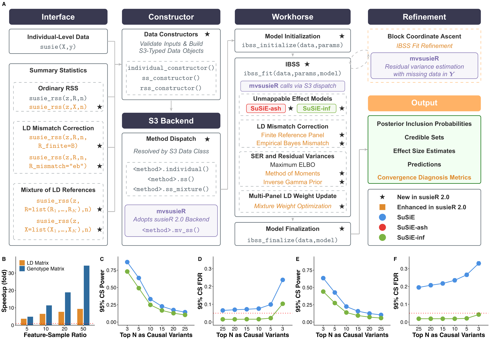
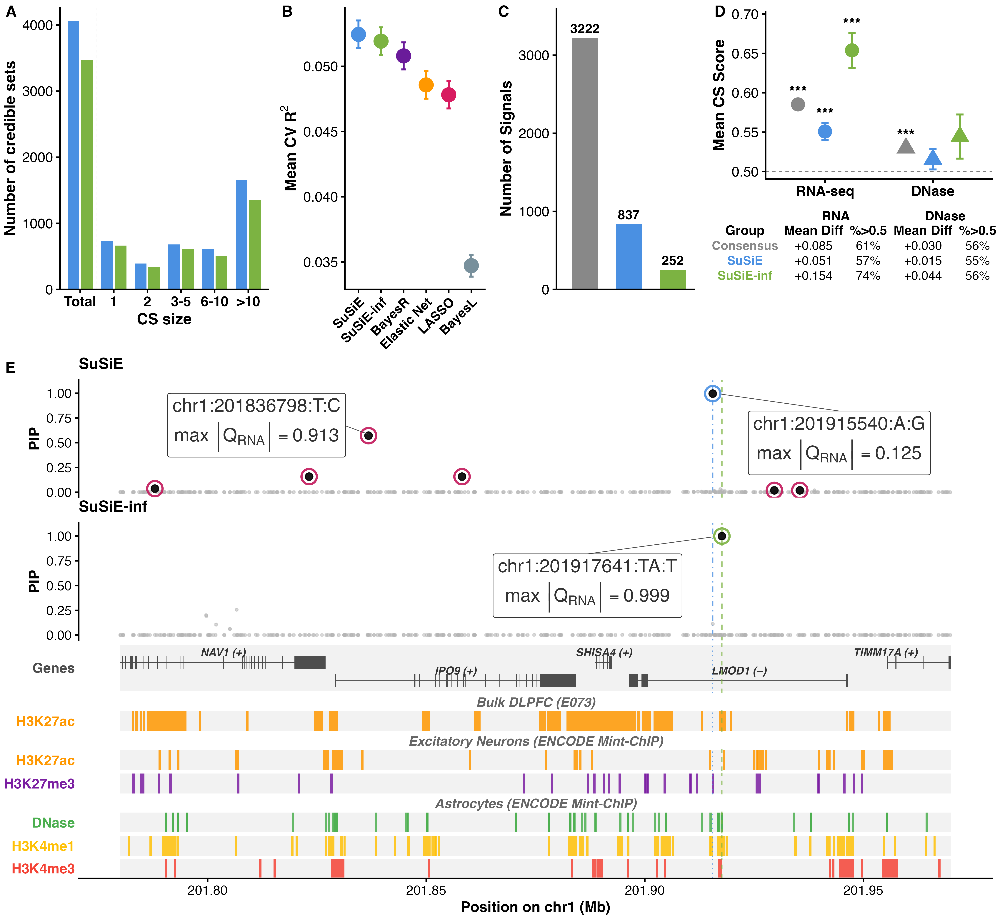

# Main Figures

This section contains the scripts used to assemble each main figure from
pre-computed results. The upstream simulation and analysis code lives under
**Simulation Studies** and **Data Applications**.

Both figures show **SuSiE** and **SuSiE-inf**. The three-method comparisons that
additionally include **SuSiE-ash** are preserved as Supplementary Figures
**S10** (Figure 1C–1F) and **S11** (Figure 2).

## Figure 1

SuSiE 2.0 software architecture overview, the runtime speedup of its new
SuSiE-inf implementation over the original, and simulation benchmarks comparing
fine-mapping power and FDR across two complex (oligogenic-plus-infinitesimal)
simulation scenarios.



Built by `figure_1/create_figure1.R` from the per-panel objects in
`figure_1/figure_1_panel_{A..F}/`.

## Figure 2

ROSMAP eQTL fine-mapping application of SuSiE 2.0 across three brain tissues,
covering credible set discovery, TWAS prediction, cross-method signal
concordance, AlphaGenome functional enrichment, and a locus example.



Built by `figure_2/create_figure2.R`. Panels are laid out and labelled in reading
order **A, B, C, D** across the top row with **E** spanning the second row; note
that the source directories keep their original names, so `figure_2_panel_C`
supplies the panel labelled **B** and `figure_2_panel_B` supplies the panel
labelled **C**.

## Reproducing

From the repository root:

```bash
Rscript run_all.R
```

This rebuilds every main and supplementary figure from data vendored in this
repository. See the root `README.md` for the path conventions and the two
environment variables that only the `extract_*` scripts need.
